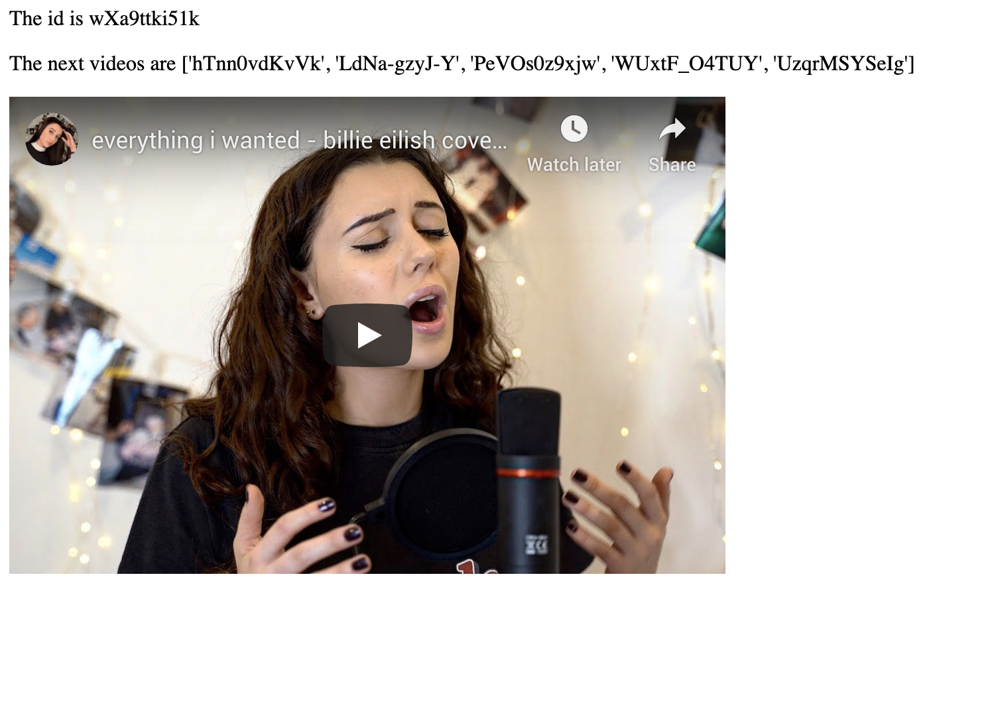

# YouTube RabbitHole Explorer

A web app to explore the rabbit hole of YouTube's suggested "Up Next" videos. 

Coded for me to learn web scraping, flask and some front-end. 

### Background

[Much has been said](https://gohsu.com/dossier.html#youtube) about YouTube's recommendation algorithm. YouTube's goal is to maximise view-time, and it does so by feeding viewers an endless stream of content that is specially curated to keep them glued to the screen. With certain kinds of videos (eg conspiracy theories, sensationalist news, alt-right opinions), the algorithm has the tendency to lead the viewer down a rabbit hole of increasingly radical content. Unsurprisingly, YouTube is quite secretive about how this algorithm is configured. Their Data API also does offer any calls for related videos, making scraping the only way to obtain this information.  Motivated by this, I wanted to explore and visualize the chain of videos that YouTube wants us to watch next.

### Required

* Selenium WebDriver (for Chrome)
* Flask

### Run on localhost

```bash
cd <projectdirectory>
export FLASK_APP=app.py
flask run
```

### Current issues/TO DO

* scraper cannot deal with ads; will end up looping between 2-3 video links although the up next algo does not really repeat videos (I suspect this is because of the ads)
* not sure how to host this, hmm...
* design a pretty front-end

### Current app



